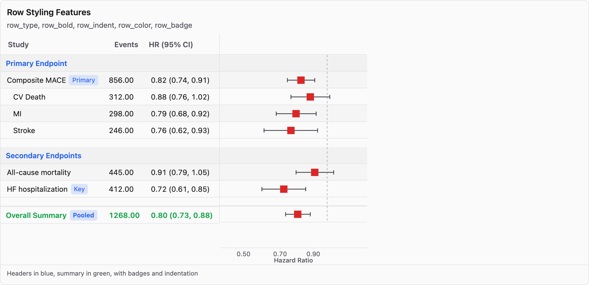

# webforest

[](https://github.com/kaskarn/webforest/actions/workflows/R-CMD-check.yaml)

Interactive, publication-ready forest plots for R. Built with Svelte 5 and D3.js.

[](https://kaskarn.github.io/webforest/gallery.html)

*Click image to view interactive gallery*

## Installation

```r
# install.packages("pak")
pak::pak("kaskarn/webforest")
```

## Quick Start

```r
library(webforest)

# Forest plot with row and column grouping
data <- data.frame(
  study = c("KEYNOTE-006", "CheckMate 067", "COMBI-v",
            "ATTRACTION-3", "KEYNOTE-590", "CheckMate 648"),
  cancer = c("Melanoma", "Melanoma", "Melanoma",
             "Gastric", "Esophageal", "Esophageal"),
  hr = c(0.63, 0.55, 0.69, 0.77, 0.73, 0.64),
  lower = c(0.52, 0.45, 0.57, 0.62, 0.60, 0.52),
  upper = c(0.76, 0.67, 0.84, 0.95, 0.88, 0.78),
  events_tx = c(289, 320, 116, 198, 286, 271),
  n_tx = c(556, 502, 352, 330, 373, 321)
)

forest_plot(data,
  point = "hr", lower = "lower", upper = "upper",
  label = "study",
  group = "cancer",  # Row grouping by cancer type
  columns = list(
    col_group("Sample",  # Column grouping
      col_n("events_tx", "Events"),
      col_n("n_tx", "N"),
      position = "left"
    ),
    col_interval("HR (95% CI)")
  ),
  scale = "log", null_value = 1,
  theme = web_theme_cochrane(),
  title = "Immune Checkpoint Inhibitor Trials"
)
```

## Features

- **Publication themes** — JAMA, Lancet, Cochrane, Nature, modern, presentation, dark, minimal
- **Rich columns** — numeric, intervals, bar charts, p-values, sparklines, badges
- **Hierarchical grouping** — collapsible nested subgroups with summaries
- **Split by subgroups** — sidebar navigation for separate plots by variable values
- **Row styling** — headers, spacers, bold/italic, indentation, custom colors
- **Interactivity** — hover, selection, tooltips, sorting, column resize
- **Layout controls** — fit/fill/responsive width modes; auto/scroll height modes
- **Export** — `save_plot()` for SVG/PDF/PNG; download button in widget toolbar
- **Fully customizable** — fluent API for theme, axis, and layout control

## Themes

Six built-in themes with full customization:

```r
# Use a preset theme
forest_plot(data, ..., theme = web_theme_lancet())

# Customize any theme
web_theme_jama() |>
  set_colors(primary = "#0066cc") |>
  set_axis(gridlines = TRUE, range_min = 0.5, range_max = 2.0) |>
  set_spacing(row_height = 28)
```

| Theme | Style |
|-------|-------|
| `web_theme_default()` | Clean, modern default |
| `web_theme_jama()` | JAMA journal (B&W, compact) |
| `web_theme_lancet()` | Lancet journal (blue, serif) |
| `web_theme_cochrane()` | Cochrane systematic reviews (compact, professional) |
| `web_theme_nature()` | Nature family journals (clean, modern) |
| `web_theme_modern()` | Contemporary UI |
| `web_theme_presentation()` | Large fonts for slides |
| `web_theme_dark()` | Dark mode |
| `web_theme_minimal()` | Minimal B&W |

## Columns

```r
forest_plot(data, ...,
  columns = list(
    col_text("study", "Study"),
    col_numeric("n", "N"),
    col_bar("weight", "Weight %"),
    col_pvalue("pval", "P-value"),
    col_sparkline("trend", "Trend"),
    col_interval("HR (95% CI)"),
    col_group("Summary",
      col_numeric("mean", "Mean"),
      col_numeric("sd", "SD")
    )
  )
)
```

## Row Styling

```r
forest_plot(data, ...,
  row_type = "type",      # "header", "data", "summary", "spacer"
  row_bold = "is_bold",   # Column for bold styling
  row_indent = "indent",  # Column for indentation level
  row_color = "color",    # Column for text color
  row_badge = "badge"     # Column for badge text
)
```

## Split Forest Plots

Create separate navigable plots for each subgroup:

```r
forest_plot(data, ...,
  split_by = "region"  # Single variable
)

forest_plot(data, ...,
  split_by = c("sex", "age_group"),  # Hierarchical: Sex > Age Group
  shared_axis = TRUE                  # Same axis range across all
)
```

A floating sidebar provides tree navigation between subgroups.

## Documentation

- [Quick start guide](https://kaskarn.github.io/webforest/guide/quick-start.html)
- [Interactive gallery](https://kaskarn.github.io/webforest/gallery.html)
- [Function reference](https://kaskarn.github.io/webforest/reference.html)

## License

MIT
