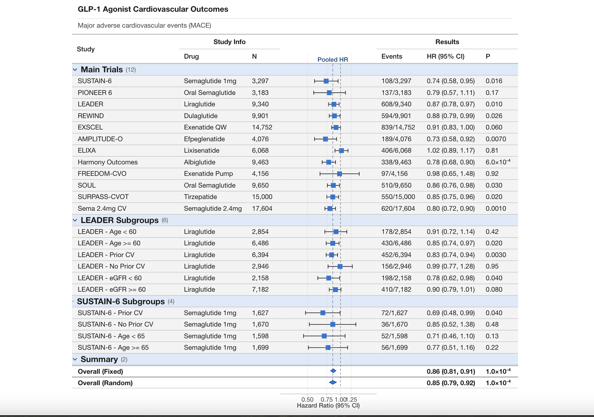

# tabviz

[](https://github.com/kaskarn/tabviz/actions/workflows/R-CMD-check.yaml)
[](https://lifecycle.r-lib.org/articles/stages.html#experimental)
[](https://www.npmjs.com/package/@tabviz/core)

**Interactive forest plots and rich data tables.** Built for
meta-analysis, regression results, dashboards, and clinical reports —
with the same Svelte 5 + D3 runtime powering both the R package and a
standalone npm package.

[](https://kaskarn.github.io/tabviz/gallery/)

*Click for the interactive gallery.*

## Two ways to use it

| | R package | npm package |
|---|---|---|
| Install | `pak::pak("kaskarn/tabviz")` | `npm install @tabviz/core svelte` |
| Build a plot | `tabviz(data, columns = list(...))` | `createTabviz(el, spec)` |
| Best for | R Markdown, Quarto, Shiny, standalone HTML | Web apps, dashboards, non-R toolchains |
| Static export | `save_plot()` → SVG / PDF / PNG | `exportToSVG()` / `exportToPNG()` |

Both consume the same wire-format `WebSpec` shape and render
identically — see [`docs/dev/versioning.md`](docs/dev/versioning.md)
for the contract.

## Quick start (R)

```r
library(tabviz)
data(glp1_trials)

tabviz(
  glp1_trials,
  label = "study",                                   # row labels
  group = "group",                                   # collapsible sections
  columns = list(
    col_group("Study Info",
      col_text("drug", "Drug"),
      col_n("n")
    ),
    viz_forest(                                      # forest plot column
      point = "hr", lower = "lower", upper = "upper",
      scale = "log", null_value = 1,
      axis_range = c(0.4, 1.5),
      axis_ticks = c(0.5, 0.75, 1.0, 1.25),
      axis_gridlines = TRUE,
      axis_label = "Hazard Ratio (95% CI)",
      annotations = list(
        refline(0.85, label = "Pooled HR", style = "dashed", color = "#00407a")
      )
    ),
    col_group("Results",
      col_events("events", "n"),                     # "42/156"
      col_interval("hr", "lower", "upper", header = "HR (95% CI)"),
      col_pvalue("pvalue", "P")                      # smart formatting
    )
  ),
  row_type = "row_type", row_bold = "row_bold",
  theme = web_theme_lancet(),
  title = "GLP-1 Agonist Cardiovascular Outcomes",
  subtitle = "Major adverse cardiovascular events (MACE)"
)
```

## Quick start (JS)

```ts
import { createTabviz } from "@tabviz/core";
import "@tabviz/core/style.css";

const instance = createTabviz(document.querySelector("#plot")!, spec, {
  width: 800,
  height: 600,
});

instance.on("selected", (rowIds) => console.log("selection:", rowIds));
instance.sortBy({ column: "hr", direction: "asc" });
```

The `WebSpec` shape that `spec` is typed against ships in
`@tabviz/core/spec` (with JSON Schema). Most consumers build it once
on the server (R-side `tabviz()` does this) and pass it through. The
npm package's [README](srcjs/README.md) covers the five subpath
exports, peer-deps, and consumption patterns.

## Highlights

- **17 column types** — `col_text`, `col_numeric`, `col_interval`,
  `col_bar`, `col_pvalue`, `col_sparkline`, `col_badge`, `col_stars`,
  `col_icon`, `col_img`, `col_reference`, `col_range`, `col_heatmap`,
  `col_progress`, `col_pictogram`, `col_ring`, `col_events`, plus
  `col_group` for nested headers.
- **Focal visualizations** — `viz_forest`, `viz_bar`, `viz_boxplot`,
  `viz_violin` for comparative displays with shared axes.
- **4 publication themes** — Cochrane (default), Lancet, JAMA, Dark —
  all on a 3-tier OKLCH-derived cascade. Full customization via
  `set_colors()`, `set_axis()`, `set_spacing()`, …
- **Row + marker styling from data** — `row_type`, `row_bold`,
  `row_badge`, `row_indent`, `marker_color`, `marker_shape`,
  `marker_size`. Conditional formatting without leaving the data frame.
- **Split tables** — `split_by = c("region", "country")` builds a
  hierarchical sidebar navigation with shared-axis option.
- **WYSIWYG static export** — SVG / PDF / PNG / PPTx match the
  rendered widget exactly (no screenshots, vector-precise).
- **Native Shiny integration** — `tabvizOutput()` + `renderTabviz()`,
  plus the proxy verbs (`paint_row()`, `sort_rows()`, `set_theme()`,
  `filter_rows()`, …) for partial updates without full re-renders.

## Themes

```r
tabviz(data, ..., theme = web_theme_lancet())

# Customize any theme
web_theme_jama() |>
  set_colors(primary = "#0066cc") |>
  set_axis(gridlines = TRUE) |>
  set_spacing(row_height = 28)
```

| Theme | Style |
|-------|-------|
| `web_theme_cochrane()` | Package default. Cochrane teal, Inter, comfortable density |
| `web_theme_lancet()` | Lancet navy + warm cream, Georgia serif, comfortable density |
| `web_theme_jama()` | All-black-and-white JAMA, ultra-compact, Arial |
| `web_theme_dark()` | Catppuccin-inspired dark canvas, pastel marker palette |

## Documentation

- **[Quick Start](https://kaskarn.github.io/tabviz/guide/quick-start.html)** — get a plot rendering in 5 minutes
- **[Gallery](https://kaskarn.github.io/tabviz/gallery/)** — 20+ examples with code
- **[Cookbook](https://kaskarn.github.io/tabviz/guide/recipes.html)** — common patterns
- **[Function reference](https://kaskarn.github.io/tabviz/reference/)** — full R API
- **[npm package README](srcjs/README.md)** — JS / TS consumption
- **Architecture & design** — [frontend split spec](docs/dev/frontend-split-spec.md), [wire-format versioning](docs/dev/versioning.md), [event contract](docs/dev/event-contract.md), [spec fields reference](docs/dev/spec-fields-reference.md), [R ↔ JS sync points](docs/dev/r-js-sync-points.md)

## License

MIT
