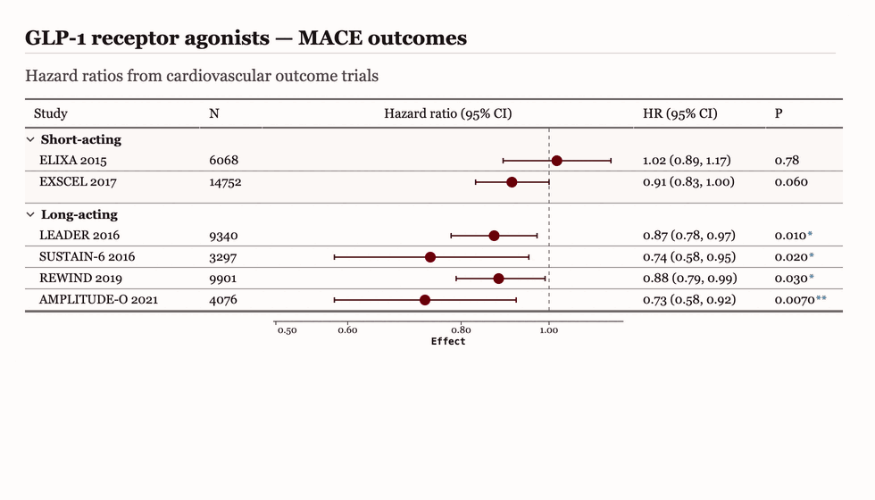
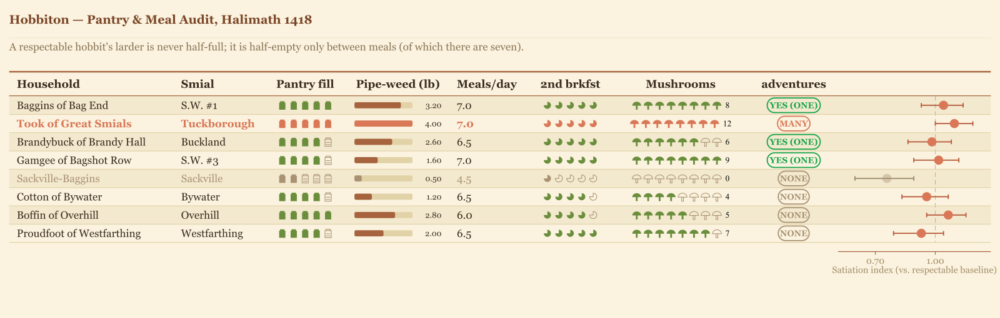

# tabviz

[](https://github.com/kaskarn/tabviz/actions/workflows/R-CMD-check.yaml)
[](https://lifecycle.r-lib.org/articles/stages.html#experimental)
[](https://www.npmjs.com/package/@tabviz/core)

**One Svelte 5 + D3 runtime. Two distributions. Identical pixels.**
tabviz is an interactive table-and-forest-plot engine that ships as
both an R htmlwidget and the [`@tabviz/core`](https://www.npmjs.com/package/@tabviz/core)
npm package, built from the same `srcjs/` source tree in the same
Vite build. The HR-with-confidence-interval you scroll through in
Shiny is the same plot — same layout solver, same axis math, same
glyph geometry — that lands in the manuscript SVG.



*One `tabviz()` call: a clinical forest table, sorted live, then
restyled across curated themes — same spec, same data, no re-render
code. Thirty seconds from a data frame:*

```r
library(tabviz)
tabviz(trials)                      # zero config — columns inferred
tabviz(trials, label = "study",     # one minute more: label, group,
  group = "class",                  # forest plot, themed output
  columns = list(
    col_n("n"),
    viz_forest(point = "hr", lower = "lower", upper = "upper", scale = "log"),
    col_pvalue("pvalue", stars = TRUE)
  ),
  theme = web_theme_nejm())
```

[](https://kaskarn.github.io/tabviz/gallery/lotr.html)

*Hobbiton's pantry & meal audit. Click for the LOTR gallery —
`web_theme_dwarven()` plus bespoke pictogram glyphs.*

## What makes this interesting

**A shared runtime, not a parallel port.** The R package and the npm
package are two delivery vehicles for one codebase. Both consume the
same `WebSpec` wire format. Both render through the same Svelte 5
component tree. No "R version" and "JS version" drift — one runtime,
two ways to hand it data.

**SemVer on the wire, not just the API.** Every `WebSpec` carries a
version field that R and JS both validate on every render. Breaking
changes to the spec bump major; additive fields bump minor; the
validator tells you when an old spec hits a new runtime instead of
silently rendering wrong. See
[`docs/dev/versioning.md`](docs/dev/versioning.md).

**WYSIWYG static export, byte-identically.** The SVG / PDF / PNG /
PPTx outputs aren't screenshots and aren't a parallel rendering
path. They come out of the same Svelte component tree, executed in a
headless V8 context and rasterized with rsvg. If a number formatter
matches a cell on screen, it matches in the PDF.

**Typed Shiny proxy verbs.** `paint_row()`, `sort_rows()`,
`filter_rows()`, `set_theme()`, `set_zoom()`, `set_aspect_ratio()`
are partial updates over a typed event bus — sort a 2000-row table
without re-laying-out the axes; recolor a selected row without
recomputing column widths.

## Where it fits among the neighbors

The R table ecosystem is rich; the existing packages are excellent at
what they do.

| Package | Excels at |
|---|---|
| `gt`, `flextable` | Static print-grade table grammars |
| `reactable`, `DT` | General-purpose interactive datatables |
| `forestplot`, `forester`, `ggforestplot` | Static forest plots |
| **tabviz** | Interactive tables + inline comparative viz + WYSIWYG publication export, in one runtime |

Different shapes of the same problem space. tabviz sits across all
three slices at once. Reach for it when the table *is* the figure —
meta-analyses, regression-result panels, subgroup comparisons, any
report where embedded plots and the surrounding columns travel
together from data frame to manuscript or dashboard.

## Install

```r
# R
pak::pak("kaskarn/tabviz")
```

```bash
# JS — svelte is a peer dependency
npm install @tabviz/core svelte
```

## Quick start (R)

```r
library(tabviz)
data(glp1_trials)

tabviz(
  glp1_trials,
  label = "study",                                   # row labels
  group = "group",                                   # collapsible sections
  columns = list(
    col_group("Study Info",
      col_text("drug", "Drug"),
      col_n("n")
    ),
    viz_forest(                                      # forest plot column
      point = "hr", lower = "lower", upper = "upper",
      scale = "log", null_value = 1,
      axis_range = c(0.4, 1.5),
      axis_ticks = c(0.5, 0.75, 1.0, 1.25),
      axis_gridlines = TRUE,
      axis_label = "Hazard Ratio (95% CI)",
      annotations = list(
        refline(0.85, label = "Pooled HR", style = "dashed", color = "#00407a")
      )
    ),
    col_group("Results",
      col_events("events", "n"),                     # "42/156"
      col_interval("hr", "lower", "upper", header = "HR (95% CI)"),
      col_pvalue("pvalue", "P")                      # smart formatting
    )
  ),
  row_type = "row_type", row_bold = "row_bold",
  theme = web_theme_lancet(),
  title = "GLP-1 Agonist Cardiovascular Outcomes",
  subtitle = "Major adverse cardiovascular events (MACE)"
)
```

Hand the same data frame to `save_plot()` and the SVG that lands in
your manuscript is identical to what's on screen.

## Quick start (JS)

```ts
import { createTabviz } from "@tabviz/core";
import "@tabviz/core/style.css";

const instance = createTabviz(document.querySelector("#plot")!, spec, {
  width: 800,
  height: 600,
});

instance.on("selected", (rowIds) => console.log("selection:", rowIds));
instance.sortBy({ column: "hr", direction: "asc" });
```

`spec` is typed against the `WebSpec` shape exported from
`@tabviz/core/spec`, with a JSON Schema alongside. Typical pattern:
build the spec server-side (R's `tabviz()` does exactly this) and
pass it through. The npm package exposes five subpath exports — `.`,
`/svelte`, `/export`, `/spec`, `/style.css` — see the
[package README](srcjs/README.md) for peer-dep details.

## Columns

Seventeen column types compose into any layout. `col_group(...)`
nests headers.

| Family | Functions |
|---|---|
| Text & numeric | `col_text`, `col_numeric`, `col_n`, `col_events`, `col_pvalue`, `col_reference` |
| Intervals & ranges | `col_interval`, `col_range` |
| Inline viz | `col_bar`, `col_sparkline`, `col_heatmap`, `col_progress`, `col_ring`, `col_pictogram` |
| Marks | `col_badge`, `col_stars`, `col_icon`, `col_img` |
| Comparative (shared axis) | `viz_forest`, `viz_bar`, `viz_boxplot`, `viz_violin` |

`viz_*` columns share a common axis across rows and accept
pooled-effect annotations, reference lines (`refline()`), and null
markers.

## Themes

```r
tabviz(data, ..., theme = web_theme_lancet())

web_theme_jama() |>
  set_brand("#0066cc") |>
  set_spacing(row_height = 28) |>
  set_type_scale(base = 15)
# axis options are per-column: viz_forest(..., axis_gridlines = TRUE)
```

| Theme | Identity |
|---|---|
| `web_theme_cochrane()` | Package default. Cochrane teal, Inter, comfortable density |
| `web_theme_lancet()` | Lancet navy + warm cream, Georgia serif |
| `web_theme_jama()` | All-black-and-white JAMA, ultra-compact, Arial |
| `web_theme_dark()` | Catppuccin-derived dark canvas, pastel markers |

All four ride the same 3-tier OKLCH-derived cascade with an
orthogonal accent slot, so semantic markers (selected, hover,
callout) stay legible across the palette. Customize colors with `set_brand()` / `set_paper()` / `set_ink()` /
`set_accent()`, type with `set_fonts()` / `set_type_scale()`, spacing
with `set_spacing()`, and axis options per-column on `viz_forest()`.

## More capabilities

- **Row + marker styling from data columns.** `row_type`, `row_bold`,
  `row_badge`, `row_indent`, `marker_color`, `marker_shape`,
  `marker_size`. Conditional formatting stays in the data frame.
- **Semantic painting.** Mark a row as `accent`, `muted`, `emphasis`,
  `bold`, or `fill` to call attention — drive it from data or push
  via the `paint_row()` proxy verb.
- **Split tables.** `split_by = c("region", "country")` builds a
  hierarchical sidebar with optional shared-axis alignment across
  panels.
- **Shiny integration.** `tabvizOutput()` + `renderTabviz()`, plus the
  proxy verbs above for partial updates without full re-renders.
- **Cross-runtime drop-in.** Same plot embeds into a non-R web app
  via `@tabviz/core` without rebuilding the spec or restyling the
  output.

## Documentation

- **[Quick Start](https://kaskarn.github.io/tabviz/guide/quick-start.html)** — a plot rendering in 5 minutes
- **[Gallery](https://kaskarn.github.io/tabviz/gallery/)** — 20+ examples with code
- **[Cookbook](https://kaskarn.github.io/tabviz/guide/recipes.html)** — patterns for meta-analyses, regression tables, subgroup splits, Shiny dashboards
- **[Function reference](https://kaskarn.github.io/tabviz/reference/)** — full R API
- **[npm package README](srcjs/README.md)** — JS / TS consumption
- **Architecture & design** — [frontend split spec](docs/dev/frontend-split-spec.md) · [wire-format versioning](docs/dev/versioning.md) · [event contract](docs/dev/event-contract.md) · [spec fields reference](docs/dev/spec-fields-reference.md) · [R ↔ JS sync points](docs/dev/r-js-sync-points.md)

## License

MIT
