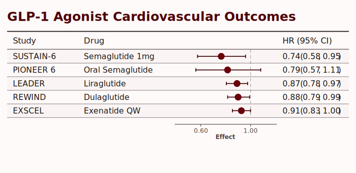
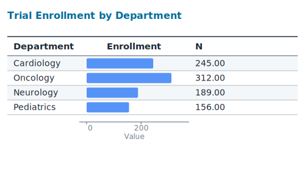
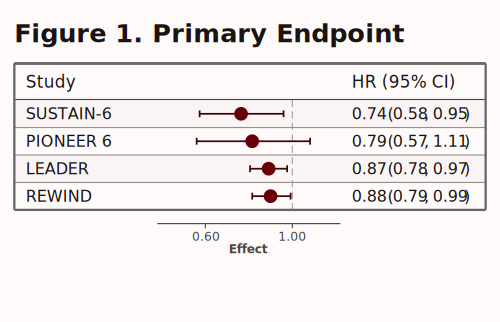
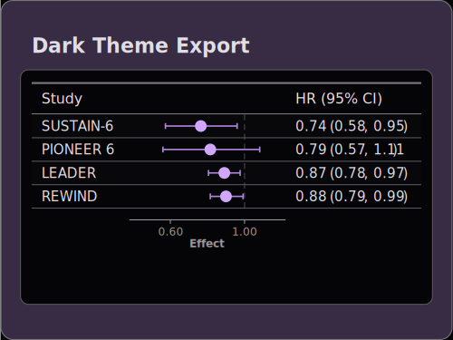

```{r}
#| include: false
library(tabviz)
library(dplyr)

if (!dir.exists("export-examples")) dir.create("export-examples")
```

Export tabviz widgets to static files for publications, presentations, and sharing. SVG is built in via the V8 engine; PNG and PDF go through the optional `rsvg` package.

## Quick Example

Build a forest plot, then write it to SVG:

```{r}
data(glp1_trials)

p <- glp1_trials |>
  filter(row_type == "data", group == "Main Trials") |>
  head(5) |>
  tabviz(
    label = "study",
    columns = list(
      col_text("drug", "Drug"),
      viz_forest(point = "hr", lower = "lower", upper = "upper",
                 scale = "log", null_value = 1, width = 180),
      col_interval("hr", "lower", "upper", header = "HR (95% CI)")
    ),
    theme = web_theme_jama(),
    title = "GLP-1 Agonist Cardiovascular Outcomes"
  )

save_plot(p, "export-examples/forest_example.svg", width = 700)
```

{width=700}

## `save_plot()` Arguments

| Argument | Default | Purpose |
|---|---|---|
| `x` | required | A `WebSpec`, htmlwidget, or `SplitForest` |
| `file` | required | Output path; format inferred from extension (`.svg`, `.png`, `.pdf`) |
| `width` | `800` | Output width in pixels |
| `height` | `NULL` | Output height (auto-derived from content if `NULL`) |
| `scale` | `2` | Pixel-density multiplier for raster output |

## Format Comparison

| Format | Use case | Dependency |
|---|---|---|
| **SVG** | Vector format, infinite scalability, journals, editing | None (built in) |
| **PNG** | Raster format, presentations, screenshots | `rsvg` package |
| **PDF** | Vector format, print publications | `rsvg` package |

::: {.callout-note}
## PNG and PDF require `rsvg`

`save_plot()` writes SVG using V8 alone. PNG and PDF formats convert that SVG via `rsvg::rsvg_png()` / `rsvg::rsvg_pdf()`. Install with `install.packages("rsvg")`.
:::

## SVG Export

```{r}
bar_data <- data.frame(
  department = c("Cardiology", "Oncology", "Neurology", "Pediatrics"),
  enrollment = c(245, 312, 189, 156)
)

p_bar <- tabviz(bar_data, label = "department",
  columns = list(
    viz_bar(effect_bar("enrollment", color = "#3b82f6"),
            header = "Enrollment", width = 180, axis_range = c(0, 350)),
    col_numeric("enrollment", "N")
  ),
  theme = web_theme_cochrane(),
  title = "Trial Enrollment by Department"
)

save_plot(p_bar, "export-examples/bar_example.svg", width = 500)
```

{width=500}

## Themed Exports

The active theme is preserved on export.

```{r}
p_jama <- glp1_trials |>
  filter(row_type == "data", group == "Main Trials") |>
  head(4) |>
  tabviz(
    label = "study",
    columns = list(
      viz_forest(point = "hr", lower = "lower", upper = "upper",
                 scale = "log", null_value = 1, width = 160),
      col_interval("hr", "lower", "upper", header = "HR (95% CI)")
    ),
    theme = web_theme_jama(),
    title = "Figure 1. Primary Endpoint"
  )

save_plot(p_jama, "export-examples/jama_theme.svg", width = 500)
```

{width=500}

```{r}
p_dark <- glp1_trials |>
  filter(row_type == "data", group == "Main Trials") |>
  head(4) |>
  tabviz(
    label = "study",
    columns = list(
      viz_forest(point = "hr", lower = "lower", upper = "upper",
                 scale = "log", null_value = 1, width = 160),
      col_interval("hr", "lower", "upper", header = "HR (95% CI)")
    ),
    theme = web_theme_dark(),
    title = "Dark Theme Export"
  )

save_plot(p_dark, "export-examples/dark_theme.svg", width = 500)
```

{width=500}

## PNG and PDF Export

```r
# PNG at 2x resolution
save_plot(p, "figure.png", width = 800, scale = 2)

# PDF for print
save_plot(p, "figure.pdf", width = 800)
```

### Resolution Guide for PNG

| `scale` | Effective DPI | Use case |
|---|---|---|
| `1` | 72 DPI | Quick preview |
| `2` | 144 DPI | Web / screen |
| `3` | 216 DPI | Presentations |
| `4` | 288 DPI | High-res print |

## Pagination — long tables across multiple pages {#pagination}

When a table is taller than a printed page (long meta-analyses, multi-cohort registries), attach `paginate = paginate_spec()` (or one of the presets) to break it into pages. The HTML viewer renders one page at a time with prev/next controls; `save_plot(*.pdf)` emits a multi-page PDF.

```{r}
data(glp1_trials)
# Synthesize a longer dataset for demonstration
big <- do.call(rbind, replicate(4, glp1_trials |>
  dplyr::filter(row_type == "data"), simplify = FALSE))
big$study <- sprintf("%s %02d", big$study, seq_len(nrow(big)))

p_long <- big |>
  tabviz(
    label = "study",
    group = "group",
    columns = list(
      col_text("drug", "Drug"),
      viz_forest(point = "hr", lower = "lower", upper = "upper",
                 scale = "log", null_value = 1, width = 180),
      col_interval("hr", "lower", "upper", header = "HR (95% CI)")
    ),
    theme = web_theme_jama(),
    title = "Long meta-analysis (paginated)",
    paginate = paginate_letter()
  )

save_plot(p_long, "export-examples/paginated.pdf", width = 700)
```

The result is a multi-page PDF — one PDF page per logical page, merged via `qpdf::pdf_combine()`:

```{r}
qpdf::pdf_length("export-examples/paginated.pdf")
```

### Configuring pagination

`paginate_spec()` exposes the full configuration; presets (`paginate_letter()`, `paginate_a4()`, `paginate_slide()`) pick sensible row counts for common formats.

| Argument | Default | Purpose |
|---|---|---|
| `rows` | `30` | Maximum data rows per page |
| `break_on` | `"split"` | Where forced breaks occur: `"split"`, `"group"`, or `"none"` |
| `keep_groups` | `TRUE` | Never break inside a group — push to next page instead |
| `orphan_min` | `3` | Minimum rows on a trailing page; pulls rows back if too thin |
| `repeat_header` / `repeat_legend` / `repeat_title` | `TRUE` | Repeat page furniture on every PDF page |
| `footnotes_on` | `"last"` | `"last"` (final page only) or `"every"` |
| `page_label` | `"x_of_y"` | `TRUE`/`FALSE`/`"x"`/`"x_of_y"` or a `function(page, total)` |
| `oversized_group_policy` | `"overflow"` | What to do when a single group is larger than `rows`: `"overflow"`, `"warn"`, `"error"` |

### Shortcuts

The `paginate` argument on `tabviz()` and `save_plot()` accepts several shortcut forms:

```r
tabviz(data, ..., paginate = TRUE)              # default paginate_spec()
tabviz(data, ..., paginate = 50)                # rows-per-page shorthand
tabviz(data, ..., paginate = paginate_letter()) # preset
tabviz(data, ..., paginate = NULL)              # explicit "no pagination"
```

A fluent modifier `paginate()` is also available for use after construction:

```r
tabviz(data, ...) |> paginate(rows = 20, orphan_min = 5)
tabviz(data, ..., paginate = TRUE) |> paginate(NULL)  # turn off
```

### Override at save time

`save_plot()` accepts its own `paginate` argument that overrides whatever is on the spec — useful for one-off renders without rebuilding:

```r
# Force a denser page count for one render
save_plot(p_long, "out.pdf", paginate = paginate_spec(rows = 50))

# Flatten a paginated spec for a single-image format
save_plot(p_long, "out.png", paginate = NULL)
```

::: {.callout-note}
## Single-image formats flatten by default

`.png` and `.svg` are single-image formats and cannot represent multiple pages. When you save a paginated tabviz to one of these, the spec is flattened to a single image and a `cli` warning fires. Pass `paginate = NULL` at the call site to silence the warning, or save to `.pdf` for true paginated output.
:::

::: {.callout-note}
## Multi-page PDF needs `qpdf`

Each page is rendered separately to SVG → PDF (via `rsvg`), then the per-page PDFs are merged with `qpdf::pdf_combine()`. If `qpdf` is not installed, `save_plot()` falls back to writing a numbered series (`out_p01.pdf`, `out_p02.pdf`, ...) and emits a warning. Install with `install.packages("qpdf")`.
:::

### Pagination + `split_by`

When `split_by` is active, `paginate` cascades to every subview — each subview owns its own page set with its own row-count budget. Saving emits one combined multi-page PDF per split leaf:

```r
sf <- tabviz(data, ..., split_by = "region", paginate = paginate_spec(rows = 20))
save_plot(attr(sf, "splitforest"), "out/region.pdf", width = 700)
# Writes: out/North.pdf, out/South.pdf, ... — each with its own pages
```

## Exporting Split Tables

Pass a `SplitForest` (the output of `split_table()`) to `save_split_table()` to write one file per subgroup. The directory structure mirrors the split hierarchy.

```r
split_p <- tabviz(data,
  label = "study",
  columns = list(
    viz_forest(point = "or", lower = "lower", upper = "upper",
               scale = "log", null_value = 1)
  )
) |>
  split_table(by = c("sex", "age_group"))

save_split_table(split_p, "output/plots", format = "svg")
# Writes: output/plots/Male/Male_Young.svg, output/plots/Female/Female_Old.svg, ...
```

`save_split_table()` accepts the same `width`, `height`, `scale` arguments as `save_plot()`. `format` is one of `"svg"`, `"pdf"`, `"png"`.

::: {.callout-tip}
## `save_plot()` accepts `SplitForest` too

If you call `save_plot(split_p, "output/plots")` it dispatches to `save_split_table()` automatically. Pass a path with an extension to control the format.
:::

## See Also

- [Themes](themes.qmd) — Style for publication
- [Reference: `save_plot()`](../reference/export.qmd) — Full API
